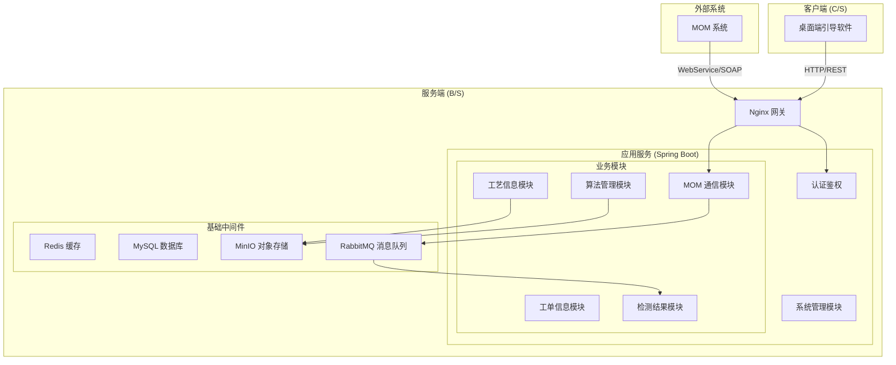

# B/S 架构设计规范说明(工业视觉装配引导与检测系统)

> **文档版本**: V1.0
> **创建日期**: 2025-12-15
> **适用对象**: 开发团队（研究生团队）、架构评审人员

---

## 1. 项目概述

本项目旨在构建一套工业视觉装配引导与检测系统的服务端管理平台（B/S 架构）。该平台主要负责与 MOM（制造运营管理）系统交互，管理工艺数据、算法模型、工单任务，并为桌面端（C/S 架构）提供鉴权、任务分发及数据收集服务。

### 1.1 核心目标

1. **MOM 集成**：通过网闸与企业内网 MOM 系统通信 (WebService/SOAP)，接收生产任务，上报检测结果。
2. **工艺数字化**：提供可视化工具，将产品装配工艺转化为计算机可识别的结构化数据（JSON + 图片）。
3. **算法管理**：统一管理视觉算法包，提供版本控制与分发服务。
4. **数据闭环**：收集 C 端检测日志与图片，实现质量追溯。

---

## 2. 技术架构设计

本项目基于 **RuoYi-Vue**（前后端分离版本）进行二次开发。

### 2.1 技术选型

| 模块               | 技术栈                 | 说明                                                                                                                                                      |
| :----------------- | :--------------------- | :-------------------------------------------------------------------------------------------------------------------------------------------------------- |
| **后端框架** | Spring Boot 2.7+ / 3.x | 核心业务逻辑容器，提供 RESTful API                                                                                                                        |
| **MOM 通信** | **Apache CXF**         | 实现 SOAP WebService 服务端，接收 MOM 推送数据                                                                                                            |
| **安全框架** | Spring Security + JWT  | 实现无状态鉴权，支持 C 端 Token 认证                                                                                                                      |
| **数据库**   | MySQL 8.0              | 存储业务数据（用户、工艺、工单等）                                                                                                                        |
| **缓存**     | Redis 6+               | 缓存用户 Token、字典数据、热点配置                                                                                                                        |
| **对象存储** | **MinIO**        | **核心组件**。存储工艺原图、检测结果图、算法包。**必须使用 Pre-signed URL 模式**，让客户端直接与 MinIO 通信，避免大文件（>20M）经过后端服务。 |
| **消息队列** | **RabbitMQ**     | **推荐引入**。用于解耦 MOM 上报接口与内部处理，处理高并发图片上传                                                                                   |
| **前端框架** | Vue 3 + Element Plus   | B 端管理后台，推荐使用 Vue 3 以获得更好的性能与开发体验                                                                                                   |

### 2.2 系统架构图 (逻辑视图)



---

## 3. 核心模块详细设计

### 3.1 系统管理模块 (System)

* **功能**：基于若依原生功能，管理用户、角色、菜单、部门。
* **适配**：支持 C 端用户使用账号密码登录，用于 API 鉴权。

### 3.2 MOM 通信模块 (MOM Bridge)

* **职责**：作为与 MOM 系统的唯一交互窗口。
* **核心流程**：
  1. **接收任务**：发布 WebService (SOAP) 接口供 MOM 调用，接收 XML/JSON 数据。
  2. **异步处理**：接收到请求后，立即存入数据库（`sys_mom_log`）并返回成功，通过 MQ 异步解析数据和生成本地工单，避免阻塞 MOM 调用。
  3. **结果上报**：定时任务或触发式扫描“待上报队列”，调用 MOM 提供的 WebService 接口回传检测结果。

### 3.3 工艺信息模块 (Process/Craft) - **重点**

本模块是连接 MOM 任务与视觉算法的核心。

* **业务对象**：
  * `Product` (产品)：对应 MOM 中的物料/产品型号（PID）。
  * `CraftPackage` (工艺包)：一个产品对应一个工艺包，包含版本号。
  * `CraftStep` (工艺步骤)：具体的装配动作。
* **功能逻辑**：
  1. **全局模板**：上传一张产品的高清实物图作为“底图”。
  2. **画布编辑 (Canvas)**：
     * 前端集成 Canvas 库（如 Fabric.js）。
     * 工艺人员在底图上框选 ROI（感兴趣区域）。
     * 为每个框选区域配置属性：`StepID`（步骤号）、`Description`（描述）、`IsMandatory`（是否强制顺序）、`AlgorithmParam`（关联的算法参数）。
  3. **导出规范**：
     * 点击发布时，后端异步生成 ZIP 包并上传至 MinIO。
     * ZIP 内容：`metadata.json`（包含所有步骤坐标、逻辑） + `template.jpg`（底图）。
     * **下载逻辑**：C 端请求下载接口，后端返回 MinIO 的 **Pre-signed GET URL**（有效期如 10分钟），C 端直接从 MinIO 下载，降低后端带宽压力。

### 3.4 算法管理模块 (Algorithm)

* **功能**：
  * **算法包上传**：采用 **Pre-signed PUT URL** 模式。
    1. B 端前端请求上传地址，后端生成 MinIO 上传链接。
    2. B 端前端直接 PUT 文件到 MinIO。
    3. 上传完成后，调用“确认上传”接口，后端记录路径并异步触发校验任务。
  * **校验**：后端异步下载并解压，检查是否包含必要的 `init.py` 或 `manifest.json`。若校验失败，标记状态为“不可用”。
  * **存储**：文件存入 MinIO，数据库记录版本号、MD5、Object Key。
* **API**：提供 `latest` 接口返回下载用的 Pre-signed URL。

### 3.5 工单信息模块 (Work Order)

* **逻辑**：
  * MOM 推送的任务在本地转化为 `WorkOrder` 记录。
  * 状态流转：`PENDING` (待领取) -> `PROCESSING` (进行中) -> `COMPLETED` (完成) / `FAILED` (异常)。
  * C 端用户登录后，拉取该用户关联或可领取的 `PENDING` / `PROCESSING` 工单。
  * **详情查询**：
    * 针对 `PROCESSING` 状态任务，可获取已执行的步骤信息。
    * 针对 `COMPLETED` 状态任务，可获取完整的执行步骤信息及最终结果信息。

### 3.6 检测结果模块 (Detection Result)

* **数据量级**：高并发写入。
* **逻辑**：
  * **步骤上报 (Step Reporting)**：
    1. C 端请求 MinIO **Pre-signed PUT URL**。
    2. 上传步骤检测图/过程图。
    3. 调用“步骤上报”接口，提交步骤状态、数据及图片 Key。
  * **结果上报 (Result Reporting)**：
    1. 任务所有步骤完成后，C 端请求 MinIO **Pre-signed PUT URL**（如需上传最终报告或总览图）。
    2. 上传图片（可选）。
    3. 调用“结果上报”接口，提交工单最终状态及图片 Key。
  * **后端处理**：后端接收轻量级 JSON，写入 MQ 或直接存库。图片流不再经过后端。
  * **查询**：提供查询页面，查看详情时前端请求图片的 Pre-signed GET URL 进行展示。

---

## 4. API 接口需求 (Endpoint Specification)

所有接口统一前缀 `/api/v1`。

### 4.1 面向 MOM 系统 (WebService Definition)

基于 SOAP 协议，服务命名空间建议为 `http://mom.business.ruoyi.com/`。

| 方法 (Method)       | 描述                                               |
| :------------------ | :------------------------------------------------- |
| `pushProductionTask`| 接收 MOM 推送的生产任务（包含 PDF 链接、物料信息） |
| `syncProcessInfo`   | 接收 MOM 推送的产品工艺信息                        |

### 4.2 面向 C 端 (桌面端)

| 方法 | 路径                           | 描述                                                |
| :--- | :----------------------------- | :-------------------------------------------------- |
| POST | `/client/auth/login`         | 用户登录，获取 Token                                |
| GET  | `/client/task/list`          | 获取当前用户待执行的任务清单                        |
| GET  | `/client/task/detail/{id}`   | 获取任务详情（包含步骤信息、结果信息）              |
| GET  | `/client/craft/url/{pid}`    | 获取工艺包（ZIP）的 MinIO 下载链接 (Pre-signed GET) |
| GET  | `/client/algo/check_update`  | 检查算法更新，返回 MinIO 下载链接 (Pre-signed GET)  |
| GET  | `/client/file/presigned/put` | 获取文件上传凭证 (Pre-signed PUT URL)               |
| POST | `/client/step/submit`        | 上报步骤执行结果（含图片 Key）                      |
| POST | `/client/result/submit`      | 上报工单最终结果（含图片 Key）                      |
| POST | `/client/log/error`          | 上报设备运行异常日志                                |

### 4.3 面向 B 端前端 (管理后台)

*遵循 RuoYi 标准 Controller 写法，使用 `@PreAuthorize` 控制权限。*

---

## 5. S/C 端交互数据规范 (Client-Server Data Spec)

本章节定义 C 端（桌面引导软件）与 S 端（服务端）的核心交互数据格式与协议。

### 5.1 通用响应结构

所有 HTTP API 响应均遵循以下 JSON 结构：

```json
{
  "code": 200,      // 状态码，200 表示成功，其他表示异常
  "msg": "操作成功", // 提示消息
  "data": { ... }   // 业务数据载体
}
```

### 5.2 核心业务交互数据定义

#### 5.2.1 用户登录 (Login)

* **Request (POST /client/auth/login)**

```json
{
  "username": "admin",
  "password": "password123",
  "client_version": "1.0.0"       // 客户端版本号
}
```

* **Response**

```json
{
  "code": 200,
  "msg": "登录成功",
  "data": {
    "token": "eyJhbGciOiJIUzUxMiJ9...", // JWT Token
    "expire_time": 1734567890           // 过期时间戳 (秒)
  }
}
```

#### 5.2.2 获取待执行任务 (Fetch Tasks)

* **Response (GET /client/task/list)**

```json
{
  "code": 200,
  "data": [
    {
      "work_order_no": "1000023451-01",     // 派工单号
      "process_no": "JZ2.940.10287GY-TX02", // 工艺编号
      "operation_no": "30",                 // 工序号
      "status": "PENDING"                   // 任务状态: PENDING / PROCESSING
    }
  ]
}
```

#### 5.2.3 获取任务详情 (Task Detail)

* **Response (GET /client/task/detail/{work_order_no})**

```json
{
  "code": 200,
  "data": {
    "base_info": {
       "work_order_no": "1000023451-01",
       "process_no": "JZ2.940.10287GY-TX02",
       "operation_no": "30",
       "status": "PROCESSING"
    },
    // 仅 PROCESSING/COMPLETED 状态返回
    "executed_steps": [
       {
         "step_id": 1,
         "step_no": "1",
         "status": "OK",
         "image_path": "...",
         "submit_time": "2025-12-17 10:01:00"
       }
    ],
    // 仅 COMPLETED 状态返回
    "result_info": {
       "final_status": "PASS",
       "end_time": "2025-12-17 10:05:00",
       "summary_image": "..."
    }
  }
}
```

#### 5.2.4 步骤上报 (Submit Step)

* **Request (POST /client/step/submit)**

```json
{
  "work_order_no": "1000023451-01",
  "step_id": 1,                       // 步骤ID
  "step_status": "OK",                // 步骤结果：OK / NG
  "image_path": "2025/12/17/task_123_step_1.jpg", // MinIO Key
  "data": { "score": 0.99 }           // 扩展数据
}
```

#### 5.2.5 结果上报 (Submit Result)

* **Request (POST /client/result/submit)**

```json
{
  "work_order_no": "1000023451-01",
  "result_status": "PASS",            // 最终结果：PASS / FAIL
  "start_time": "2025-12-17 10:00:00",
  "end_time": "2025-12-17 10:05:30",
  "image_path": "2025/12/17/task_123_final.jpg", // 可选，总览图 Key
  "summary_data": { ... }             // 可选，统计数据
}
```

#### 5.2.6 异常日志上报 (Error Log)

* **Request (POST /client/log/error)**

```json
{
   "level": "ERROR",           // INFO, WARN, ERROR
   "module": "CameraDevice",   // 模块名称
   "message": "Camera connect failed: timeout", // 简短描述
   "stack_trace": "java.net.SocketTimeoutException: ...", // 详细堆栈
   "occurred_time": "2025-12-17 10:06:00"
}
```

### 5.3 错误码定义 (Error Codes)

| 错误码 (Code)   | 说明                       | 处理建议                           |
| :-------------- | :------------------------- | :--------------------------------- |
| **200**   | **操作成功**         | 正常处理业务数据                   |
| **401**   | **认证失败**         | Token 无效或过期，客户端需重新登录 |
| **403**   | **权限不足**         | 该设备无权访问此接口               |
| **404**   | **资源未找到**       | 请求的工单或资源不存在             |
| **500**   | **系统内部错误**     | 服务端异常，请重试或联系管理员     |
| **10001** | **版本过低**         | 客户端版本过低，强制升级           |
| **20001** | **工单状态异常**     | 工单已结案或不可执行               |
| **20002** | **工艺未就绪**       | 关联的工艺包或算法未发布，无法下载 |
| **30001** | **上传凭证获取失败** | MinIO 签名生成失败，请重试         |

---

## 6. MOM 数据交互规范 (MOM Data Spec)

基于 `BS\MOM` 目录下的数据样例，本章节定义 MOM 推送数据的结构解析与映射策略。

### 6.1 产品工艺数据 (`产品工艺.json`)

MOM 推送的工艺数据是系统“工艺信息模块”的基础。需解析并存储为 `Product` 和 `CraftPackage`。

#### 6.1.1 数据结构

```json
{
  "process_info": {
    "process_no": "JZ2.940.10287GY-TX02", // 工艺编号 -> 关联 Product
    "process_version": "N.1",             // 版本号 -> CraftPackage Version
    "process_name": "Ls波段上天线工艺",
    "process_desc": "..."
  },
  "operation_list": [
    {
      "operation_info": {
        "operation_no": "30",            // 工序编号
        "operation_name": "装配"
      },
      "step_list": [                     // 工步列表 -> 映射为 CraftStep
        {
          "step_no": "1",
          "step_content": "按表格准备零部件和辅料。"
        }
      ],
      "operation_material_info": [       // 物料清单 (BOM)
        {
          "material_no": "130000461",
          "material_name": "平垫圈",
          "material_quantity": 4
        }
      ]
    }
  ]
}
```

#### 6.1.2 映射策略

1. **工艺识别**：使用 `process_no` + `process_version` 作为唯一键。若数据库中不存在，则创建新的工艺包记录。
2. **工步解析**：`step_list` 中的文本内容需展示在前端“画布编辑”的待选列表中，供工艺人员拖拽或关联到图片区域。
3. **物料关联**：`operation_material_info` 需存储，以便在 C 端作业时提示操作员需消耗的物料。

### 6.2 工序任务数据 (`工序任务同步.json`)

MOM 下发的生产指令，解析为本地的 `WorkOrder`。

#### 6.2.1 数据结构

```json
{
  "order_info": {
    "production_order_no": "1000023451", // 生产订单号
    "product_batch": "202503",           // 批次
    "material_no": "120099483"           // 物料号
  },
  "work_order_list": [
    {
      "work_order_info": {
        "work_order_no": "1000023451-01", // 派工单号 (主键)
        "process_no": "JZ2.940.10287GY-TX02", // 关联工艺
        "process_version": "N.1",
        "work_order_quantity": 1
      },
      "dispatch_task_info": {
        "operation_no": "30",
        "worker_code": "07488",          // 操作员绑定
        "planned_start_time": "2025-12-09T08:30:00",
        "step_list": [...]               // 具体的工步执行要求
      }
    }
  ]
}
```

#### 6.2.2 处理逻辑

1. **工单生成**：遍历 `work_order_list`，为每个 `work_order_no` 生成一条工单记录。
2. **工艺绑定**：根据 `process_no` 和 `process_version` 自动关联已存在的工艺包。若工艺包未发布（无视觉算法数据），该工单状态应标记为 `BLOCKED`（阻塞）。
3. **人员/设备绑定**：`worker_code` 可用于自动分配工单到指定 C 端登录账号。

### 6.3 WebService 接口定义 (WebService Definition)

#### 6.3.1 接收生产任务 (pushProductionTask)

| 属性               | 说明                                                          |
| :----------------- | :------------------------------------------------------------ |
| **Method Name** | `pushProductionTask`                                        |
| **Namespace** | `http://mom.business.ruoyi.com/`                            |
| **调用时机** | MOM 系统下发新的生产工单时调用                                |
| **功能**     | 接收工单信息，生成本地 `WorkOrder` 记录，并异步下载关联资源 |

**参数定义 (Input)**:

*   `taskJson` (String): JSON 格式字符串，结构见 **6.2.1 数据结构**

**响应定义 (Output)**:

*   Return (String): JSON 格式字符串

```json
{
  "code": 200,
  "msg": "接收成功"
}
```

**错误码**:

| Code  | 描述         | 处理建议                   |
| :---- | :----------- | :------------------------- |
| 200   | 接收成功     | 正常流程                   |
| 50001 | 数据格式错误 | 检查 JSON 结构是否符合规范 |
| 50002 | 重复的工单号 | 忽略或记录日志，幂等处理   |

#### 6.3.2 接收产品工艺 (syncProcessInfo)

| 属性               | 说明                                                             |
| :----------------- | :--------------------------------------------------------------- |
| **Method Name** | `syncProcessInfo`                                           |
| **Namespace** | `http://mom.business.ruoyi.com/`                            |
| **调用时机** | MOM 系统新增或更新产品工艺时调用                                 |
| **功能**     | 同步工艺基础信息，创建或更新本地 `Product` 和 `CraftPackage` |

**参数定义 (Input)**:

*   `processJson` (String): JSON 格式字符串，结构见 **6.1.1 数据结构**

**响应定义 (Output)**:

*   Return (String): JSON 格式字符串

```json
{
  "code": 200,
  "msg": "同步成功"
}
```

**错误码**:

| Code  | 描述         | 处理建议           |
| :---- | :----------- | :----------------- |
| 200   | 同步成功     | 正常流程           |
| 50003 | 工艺版本冲突 | 检查版本号是否递增 |

### 6.4 原始数据存储 (Raw Data Storage)

为保证数据的可追溯性及问题排查能力，MOM 推送的所有原始 JSON 数据必须完整存储。

**存储表设计 (`sys_mom_log`)**:

| 字段名             | 类型          | 说明                                                                           |
| :----------------- | :------------ | :----------------------------------------------------------------------------- |
| `log_id`         | BIGINT (PK)   | 主键                                                                           |
| `req_type`       | VARCHAR(50)   | 请求类型，枚举值：`TASK_PUSH`, `PROCESS_SYNC`                              |
| `req_payload`    | LONGTEXT/JSON | **完整存储 MOM 推送的原始 JSON 数据**                                    |
| `req_time`       | DATETIME      | 接收时间                                                                       |
| `process_status` | VARCHAR(20)   | 处理状态：`RECEIVED` (已接收), `PROCESSED` (已处理), `FAILED` (处理失败) |
| `err_msg`        | VARCHAR(500)  | 异常信息（如有）                                                               |

**存储策略**:

1. **同步写入**：在 Controller 层接收到请求的第一时间，**同步**写入此表，确保即使后续业务逻辑报错，原始数据也不丢失。
2. **数据清理**：由于 `req_payload` 可能较大，建议设置定时任务（如每月 1 日）清理 3 个月前的历史日志。

---

## 7. 开发规范 (Student Guide)

### 7.1 目录结构建议

在 `ruoyi-admin` 模块中不建议写业务代码，请在 `ruoyi-system` 或新建 `ruoyi-business` 模块中开发。建议新建模块以保持架构清晰：

```text
ruoyi-business/
├── src/main/java/com/ruoyi/business/
│   ├── controller/    # 控制层
│   ├── domain/        # 实体类
│   ├── service/       # 业务逻辑层
│   ├── mapper/        # 数据持久层
│   └── mom/           # 专门处理 MOM 对接的逻辑
```

### 7.2 命名规范

* **Java 类名**：使用 PascalCase（大驼峰），如 `CraftService`。
* **方法名**：使用 camelCase（小驼峰），如 `getTaskById`。
* **数据库表**：使用 `snake_case`，并加模块前缀。
  * 系统表：`sys_`
  * 工艺表：`biz_craft_`
  * 工单表：`biz_order_`
  * 日志表：`biz_detect_log_`

### 7.3 数据库设计规约

* 每个表必须包含 `create_time`, `update_time`, `create_by`, `update_by`, `remark` 字段（继承 RuoYi 的 `BaseEntity`）。
* **严禁**使用外键，关联关系在代码层面维护。
* 所有图片、文件字段只存储 **MinIO 的相对路径** 或 **URL**，不存储二进制流。

### 7.4 异常处理

* 统一使用 `throw new ServiceException("错误信息")`。
* 前端响应结构统一为 `{ "code": 200, "msg": "操作成功", "data": ... }`。

### 7.5 版本管理 (Git)

* **master**: 主分支，仅限发布版本。
* **dev**: 开发主分支。
* **feat/xxx**: 功能分支，从 dev 切出，开发完合并回 dev。
* **提交信息 (Commit Message)**: `feat: 新增工艺上传功能` 或 `fix: 修复 MOM 解析错误`。

---

## 8. 部署与扩展性建议

### 8.1 单节点高性能部署 (Single Node High Performance)

推荐使用 Docker Compose 进行一键部署，确保环境一致性。

**`docker-compose.yml` 参考配置**:

```yaml
version: '3.8'
services:
  # 1. 业务服务 (Server)
  server:
    build: .
    container_name: procvision-server
    ports:
      - "8080:8080"
    environment:
      - SPRING_DATASOURCE_HOST=mysql
      - SPRING_REDIS_HOST=redis
    depends_on:
      - mysql
      - redis

  # 2. 数据库 (MySQL)
  mysql:
    image: mysql:8.0
    container_name: procvision-mysql
    environment:
      MYSQL_ROOT_PASSWORD: root_password
      MYSQL_DATABASE: procvision
    volumes:
      - ./data/mysql:/var/lib/mysql
    command: --character-set-server=utf8mb4 --collation-server=utf8mb4_unicode_ci

  # 3. 缓存 (Redis)
  redis:
    image: redis:6.2
    container_name: procvision-redis
    volumes:
      - ./data/redis:/data

  # 4. 对象存储 (MinIO)
  minio:
    image: minio/minio
    container_name: procvision-minio
    ports:
      - "9000:9000"
      - "9001:9001"
    environment:
      MINIO_ROOT_USER: admin
      MINIO_ROOT_PASSWORD: password
    volumes:
      - ./data/minio:/data
    command: server /data --console-address ":9001"

  # 5. 网关 (Nginx)
  nginx:
    image: nginx:1.20
    container_name: procvision-nginx
    ports:
      - "80:80"
    volumes:
      - ./html/dist:/usr/share/nginx/html
      - ./nginx/conf/nginx.conf:/etc/nginx/nginx.conf
    depends_on:
      - server
```

### 8.2 其他建议

1. **MinIO 部署**：建议使用 Docker 部署 MinIO，并配置 Nginx 代理图片的访问路径。
2. **安全性**：C 端与 Server 端建议使用 HTTPS 通信。
3. **扩展性**：如果检测图片量巨大（如每天 10万+），需考虑将 `biz_detect_log` 表按月分表，或迁移至时序数据库/ElasticSearch。

---

**请严格按照本文档进行架构搭建与开发。如有疑问，请组织架构评审会议讨论。**
